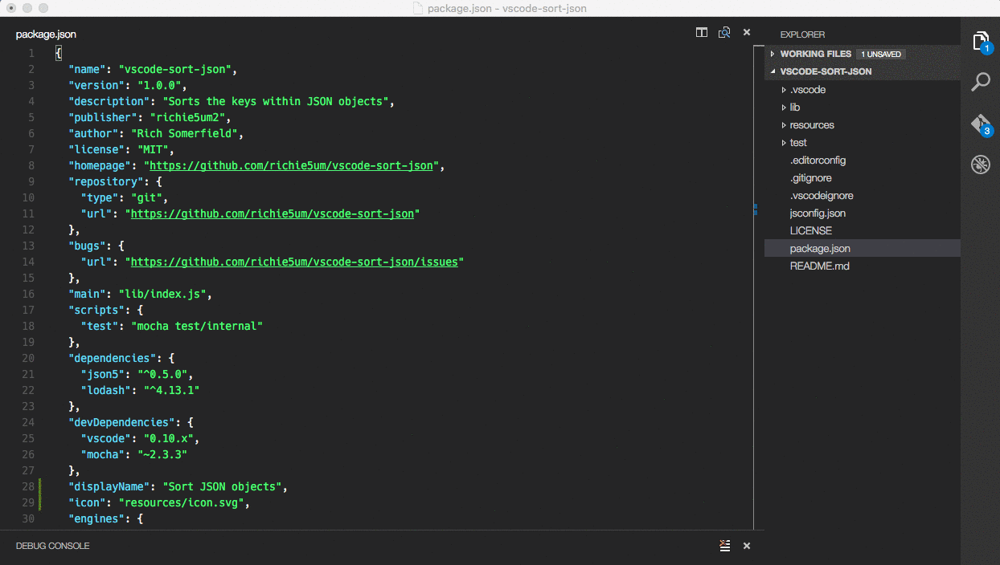

# What is it?

Alphabetically sorts the keys in _selected_ JSON objects.

> **Please take care using this** - I've tried to ensure it won't invalidate your JSON. But, as it has to parse > sort > stringify, there is a chance it'll lose something. It should be fine for plain JSON.

> Disclaimer:

> 

# Install

* Install via VSCode extensions install

# Usage

* Select a JSON object (note, it uses full lines so ensure the selected lines are a valid JSON object)
* Run the extension (Cmd+Shift+P => Sort JSON)

# Example

# Settings

* You can override the sort order (note: this applies to all levels and overrides reverse sort too). Add this to your preferences (settings.json):
    * `"sortJSON.orderOverride": ["name", "version", "description"]`
* You can underride the sort order (note: this applies to all levels and underrides reverse sort too). Add this to your preferences (settings.json):
    * `"sortJSON.orderUnderride": ["dependencies", "devDependencies"]`